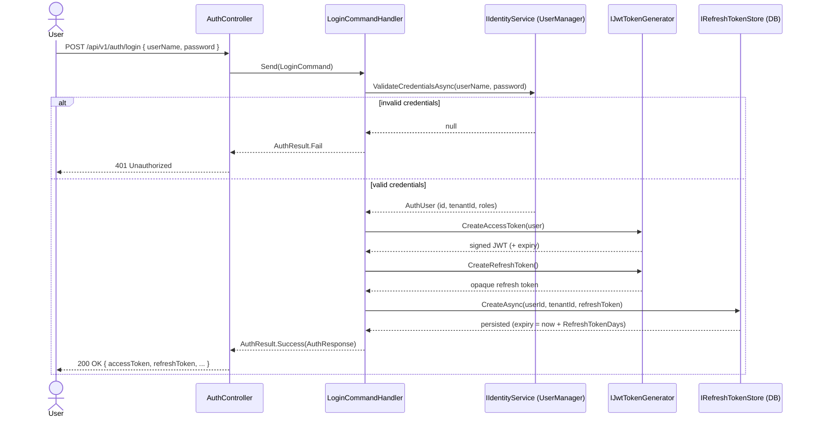
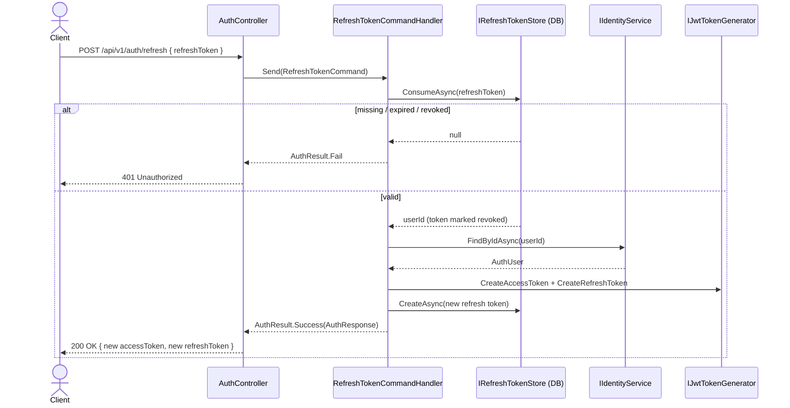

# Auth Flow

Authentication and authorization: login, tokens, refresh, roles, permissions, and user management.

## Overview

Authentication is built on **ASP.NET Core Identity** (EF Core stores) issuing **JWT access tokens** plus
opaque, single-use **refresh tokens**. Users sign in with **username + password**; Google OAuth is stubbed.

Authorization is a **hybrid RBAC + tenant-scoped PBAC model**:
- **System roles** (Admin, Manager, WarehouseOperator, Viewer) provide the baseline hierarchy
- **Tenant permission matrix** (`TenantPermission` entity) allows admins to override permissions per role per resource per tenant
- Controllers use **resource-based policies** (`warehouses:read`, `warehouses:write`) resolved by `TenantPermissionHandler`
- If no tenant override exists, the system role hierarchy applies as fallback

## Roles

Four canonical roles are seeded at startup:

| Role                | System Default                                        |
| ------------------- | ----------------------------------------------------- |
| `Admin`             | Full access, user/tenant admin, bypasses all permission checks |
| `Manager`           | Manage catalog, orders, suppliers, customers, and stock operations |
| `WarehouseOperator` | Execute day-to-day stock operations (receiving, picking, packing, transfers, adjustments, audits) |
| `Viewer`            | View dashboard and reports; read-only                 |

On first startup, the **first registered user automatically gets the Admin role** (`IdentitySeeder.SeedAdminUserAsync`).

## Authorization System

### Role Hierarchy (fallback)

Higher roles inherit lower-privilege system policies:

| Policy              | Satisfied by roles                                         | Purpose |
| ------------------- | ---------------------------------------------------------- | ------- |
| `RequireAdmin`      | `Admin`                                                    | Admin-only endpoints |
| `RequireManager`    | `Admin`, `Manager`                                         | Legacy fallback |
| `RequireOperator`   | `Admin`, `Manager`, `WarehouseOperator`                    | Legacy fallback |
| `RequireViewer`     | `Admin`, `Manager`, `WarehouseOperator`, `Viewer`          | Legacy fallback |

### Resource-Based Policies (primary)

Every controller action uses **resource-level policies** checked by `TenantPermissionHandler`:

| Policy Format       | Example                    | Allowed Actions |
| ------------------- | -------------------------- | --------------- |
| `{resource}:read`   | `warehouses:read`          | GET requests    |
| `{resource}:write`  | `stock-receipts:write`     | POST, PUT, DELETE |

**16 resources** are defined in `Resources.All`:

```
warehouses, inventory-items, item-categories, units-of-measure,
stock-receipts, pick-orders, pack-orders, stock-transfers,
stock-adjustments, stock-audits,
suppliers, purchase-orders, customers, sales-orders,
reports, users
```

### Authorization Flow

```
Request → [Authorize(Policy = "warehouses:write")]
            │
            ├── Admin role? → Allowed (bypass)
            │
            ├── TenantPermission exists for this role + resource?
            │     ├── YES → Check CanRead/CanWrite
            │     │         ├── Allowed → Succeed
            │     │         └── Denied → 403
            │     │
            │     └── NO → Fallback to system role hierarchy
            │               ├── Viewer has only read
            │               ├── WarehouseOperator can read+write
            │               └── Manager can read+write
            │
            └── Not authenticated → 401
```

### Tenant Permission Matrix

Stored in `TenantPermissions` table:

| Column      | Description |
| ----------- | ----------- |
| `TenantId`  | Tenant that owns this override |
| `RoleName`  | ASP.NET Identity role (e.g. "WarehouseOperator") |
| `Resource`  | Resource key (e.g. "warehouses") |
| `CanRead`   | Allow GET |
| `CanWrite`  | Allow POST/PUT/DELETE |
| `CanDelete` | Allow DELETE (reserved) |

**Admin API:** `PUT /api/v1/tenant-permissions/bulk` — saves the entire matrix in one request.

**Admin UI:** `/admin/permissions` — checkbox grid (roles × resources), grouped by role with bulk save.

**Default behavior** (no TenantPermission rows): system role hierarchy applies unchanged.

**Example override:** Add a row `{WarehouseOperator, warehouses, CanRead=true, CanWrite=false}` →
WarehouseOperator can view warehouses but cannot create/edit/delete them in that tenant.

## Controller Authorization Map

| Controllers | Resource | GET Policy | Write Policy |
|---|---|---|---|
| WarehousesController | `warehouses` | `warehouses:read` | `warehouses:write` |
| InventoryItemsController | `inventory-items` | `inventory-items:read` | `inventory-items:write` |
| ItemCategoriesController | `item-categories` | `item-categories:read` | `item-categories:write` |
| UnitsOfMeasureController | `units-of-measure` | `units-of-measure:read` | `units-of-measure:write` |
| StockReceiptsController | `stock-receipts` | `stock-receipts:read` | `stock-receipts:write` |
| PickOrdersController | `pick-orders` | `pick-orders:read` | `pick-orders:write` |
| PackOrdersController | `pack-orders` | `pack-orders:read` | `pack-orders:write` |
| StockTransfersController | `stock-transfers` | `stock-transfers:read` | `stock-transfers:write` |
| StockAdjustmentsController | `stock-adjustments` | `stock-adjustments:read` | `stock-adjustments:write` |
| StockAuditsController | `stock-audits` | `stock-audits:read` | `stock-audits:write` |
| SuppliersController | `suppliers` | `suppliers:read` | `suppliers:write` |
| PurchaseOrdersController | `purchase-orders` | `purchase-orders:read` | `purchase-orders:write` |
| CustomersController | `customers` | `customers:read` | `customers:write` |
| SalesOrdersController | `sales-orders` | `sales-orders:read` | `sales-orders:write` |
| ReportsController | `reports` | `reports:read` | — |
| UsersController | `users` | `users:read` | `users:write` |
| TenantPermissionsController | — | — | `RequireAdmin` |

**AuthController** remains `[AllowAnonymous]`.

## User Management

### Admin API — `/api/v1/users`

| Method | Route | Policy | Description |
|---|---|---|---|
| `GET` | `/api/v1/users` | `RequireAdmin` | List all users in tenant with roles |
| `POST` | `/api/v1/users` | `RequireAdmin` | Create user with password and roles |
| `GET` | `/api/v1/users/{id}` | `RequireAdmin` | Get single user |
| `PUT` | `/api/v1/users/{id}/roles` | `RequireAdmin` | Update user roles |
| `DELETE` | `/api/v1/users/{id}` | `RequireAdmin` | Delete user |
| `GET` | `/api/v1/users/roles` | `RequireAdmin` | List available role names |

**Admin UI:** `/admin/users` — user list with inline role toggles (click to assign/remove), create new user form with role selection.

## Sidebar Navigation

The sidebar filters menu items by the logged-in user's roles:

| Role | Visible Items |
|---|---|
| `Admin` | All items including Admin |
| `Manager` | Dashboard, catalog, operations, orders, reports (no Admin) |
| `WarehouseOperator` | Dashboard, operations, reports (no catalog, orders, admin) |
| `Viewer` | Dashboard, reports only |

Implementation in `Sidenav` component — uses `computed()` signal filtered by `AuthService.currentUser().roles`.

## Endpoints — `/api/v1/auth`

All are anonymous; see [[03-API-Endpoints]] for the wider API conventions.

| Method | Route                     | Description                                            | Success / Failure        |
| ------ | ------------------------- | ------------------------------------------------------ | ------------------------ |
| POST   | `/api/v1/auth/register`   | Create a user in a tenant; returns an initial token pair | `200` / `400` (errors) |
| POST   | `/api/v1/auth/login`      | Username + password → token pair                       | `200` / `401`            |
| POST   | `/api/v1/auth/refresh`    | Rotate a valid refresh token → new token pair          | `200` / `401`            |
| POST   | `/api/v1/auth/google`     | Google OAuth (placeholder, not implemented)            | `501`                    |

**Login body**

```json
{ "userName": "operator1", "password": "P@ssw0rd!" }
```

**Token pair response** (`login` / `register` / `refresh`)

```json
{
  "userId": "00000000-0000-0000-0000-000000000000",
  "userName": "operator1",
  "email": "operator1@example.com",
  "tenantId": "00000000-0000-0000-0000-000000000000",
  "roles": ["WarehouseOperator"],
  "accessToken": "eyJhbGciOiJIUzI1NiIsInR5cCI6IkpXVCJ9...",
  "accessTokenExpiresAtUtc": "2026-06-15T21:15:00Z",
  "refreshToken": "base64-opaque-token"
}
```

**Register body** — `role` defaults to `Viewer`; `tenantId` is required.

```json
{
  "userName": "manager1",
  "email": "manager1@example.com",
  "password": "P@ssw0rd!",
  "tenantId": "00000000-0000-0000-0000-000000000000",
  "role": "Manager"
}
```

## Login flow



## Refresh flow

Refresh tokens are **single-use**: consuming one revokes it and issues a fresh pair (rotation). The refresh
endpoint needs only the token — no `X-Tenant-Id` header — so `refresh_tokens` is intentionally **not**
tenant-filtered.



## Access token claims & tenancy

The JWT carries: `sub` (user id), `jti`, `unique_name` (username), `email`, role claims, and a custom
`tenant_id` claim. On authenticated requests, `HttpTenantProvider` resolves the tenant from the
`X-Tenant-Id` header if present, otherwise **falls back to the `tenant_id` claim** — so a logged-in user is
automatically scoped to their tenant. See [[01-Architecture]] and [[02-Database-Schema]] for the tenant
query filter.

## Configuration

`Jwt` and `Authentication:Google` sections in `appsettings.json` (placeholders; real secrets via user
secrets / environment variables):

```json
{
  "Jwt": {
    "Issuer": "WarehouseKG",
    "Audience": "WarehouseKG",
    "SigningKey": "__PLACEHOLDER__",
    "AccessTokenMinutes": 15,
    "RefreshTokenDays": 7
  },
  "Authentication": {
    "Google": { "ClientId": "__PLACEHOLDER__", "ClientSecret": "__PLACEHOLDER__" }
  }
}
```

- `SigningKey` must be ≥ 32 bytes (HS256). `appsettings.Development.json` ships a throwaway dev key.
- The token is validated by JWT bearer (issuer, audience, signing key, lifetime, 1-min clock skew). Swagger
  UI exposes an **Authorize** button for pasting an access token.

## Future: Google OAuth

`POST /api/v1/auth/google` is a stub returning `501 Not Implemented` (it reports whether
`Authentication:Google:ClientId` has been configured). The planned flow: validate the Google ID token,
match/provision an `ApplicationUser` for the tenant, then issue the same JWT + refresh-token pair as
password login.
