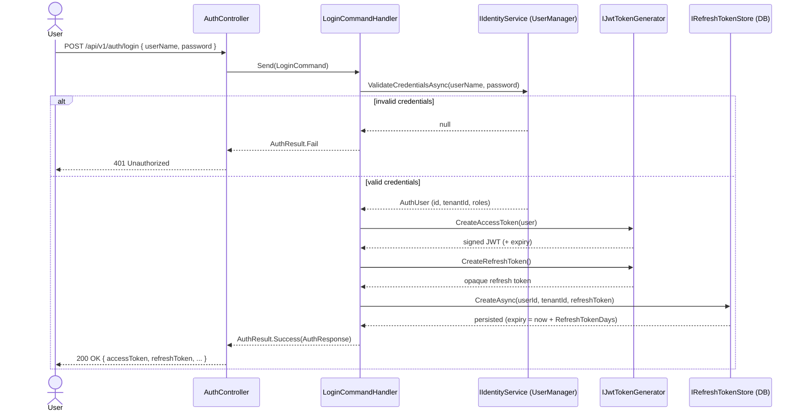
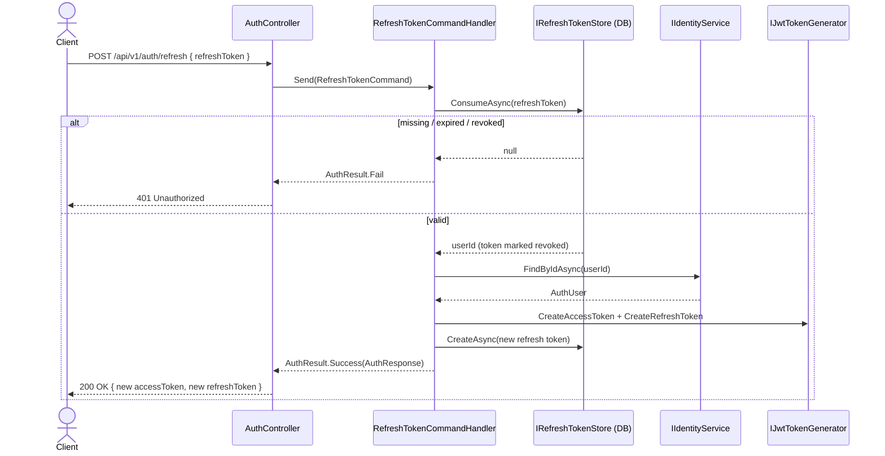

# Auth Flow

Authentication and authorization: login, tokens, refresh, roles, and permissions.

## Overview

Authentication is built on **ASP.NET Core Identity** (EF Core stores) issuing **JWT access tokens** plus
opaque, single-use **refresh tokens**. Today users sign in with **username + password**; **Google OAuth**
is stubbed for a future iteration. Authorization is **role-based** via named policies.

- Identity types (`ApplicationUser`, `ApplicationRole`, `RefreshToken`) live in `WarehouseKG.Infrastructure`
  to keep the Domain pure. The Application layer talks to them only through abstractions
  (`IIdentityService`, `IJwtTokenGenerator`, `IRefreshTokenStore`).
- Auth use-cases are MediatR commands (`RegisterCommand`, `LoginCommand`, `RefreshTokenCommand`) behind
  `AuthController`, matching the rest of the codebase.
- Identity tables (`AspNetUsers`, `AspNetRoles`, …) and `refresh_tokens` are created by the
  `AddIdentityAndAuth` migration (see [[02-Database-Schema]]).

## Roles

Four canonical roles are seeded at startup (`Roles` in the Domain):

| Role                | Intent                                              |
| ------------------- | --------------------------------------------------- |
| `Admin`             | Full access, including user/tenant administration   |
| `Manager`           | Manage catalog, orders, and stock operations        |
| `WarehouseOperator` | Execute day-to-day stock operations                 |
| `Viewer`            | Read-only access                                    |

## Authorization policies

Registered in `AuthorizationPolicies.AddWarehouseAuthorization`. Higher roles satisfy lower-privilege
policies (an `Admin` satisfies every policy).

| Policy            | Satisfied by roles                                       |
| ----------------- | -------------------------------------------------------- |
| `RequireAdmin`    | `Admin`                                                  |
| `RequireManager`  | `Admin`, `Manager`                                       |
| `RequireOperator` | `Admin`, `Manager`, `WarehouseOperator`                  |
| `RequireViewer`   | `Admin`, `Manager`, `WarehouseOperator`, `Viewer`        |

Apply with `[Authorize(Policy = AuthorizationPolicies.RequireManager)]` on controllers/actions. (Existing
domain controllers are not yet decorated — that rollout is tracked in [[09-Roadmap]].)

## Endpoints — `/api/v1/auth`

All are anonymous; see [[03-API-Endpoints]] for the wider API conventions.

| Method | Route                     | Description                                            | Success / Failure        |
| ------ | ------------------------- | ------------------------------------------------------ | ------------------------ |
| POST   | `/api/v1/auth/register`   | Create a user in a tenant; returns an initial token pair | `200` / `400` (errors) |
| POST   | `/api/v1/auth/login`      | Username + password → token pair                       | `200` / `401`            |
| POST   | `/api/v1/auth/refresh`    | Rotate a valid refresh token → new token pair          | `200` / `401`            |
| POST   | `/api/v1/auth/google`     | Google OAuth (placeholder, not implemented)            | `501`                    |

**Login body**

```json
{ "userName": "operator1", "password": "P@ssw0rd!" }
```

**Token pair response** (`login` / `register` / `refresh`)

```json
{
  "userId": "00000000-0000-0000-0000-000000000000",
  "userName": "operator1",
  "email": "operator1@example.com",
  "tenantId": "00000000-0000-0000-0000-000000000000",
  "roles": ["WarehouseOperator"],
  "accessToken": "eyJhbGciOiJIUzI1NiIsInR5cCI6IkpXVCJ9...",
  "accessTokenExpiresAtUtc": "2026-06-15T21:15:00Z",
  "refreshToken": "base64-opaque-token"
}
```

**Register body** — `role` defaults to `Viewer`; `tenantId` is required.

```json
{
  "userName": "manager1",
  "email": "manager1@example.com",
  "password": "P@ssw0rd!",
  "tenantId": "00000000-0000-0000-0000-000000000000",
  "role": "Manager"
}
```

## Login flow



## Refresh flow

Refresh tokens are **single-use**: consuming one revokes it and issues a fresh pair (rotation). The refresh
endpoint needs only the token — no `X-Tenant-Id` header — so `refresh_tokens` is intentionally **not**
tenant-filtered.



## Access token claims & tenancy

The JWT carries: `sub` (user id), `jti`, `unique_name` (username), `email`, role claims, and a custom
`tenant_id` claim. On authenticated requests, `HttpTenantProvider` resolves the tenant from the
`X-Tenant-Id` header if present, otherwise **falls back to the `tenant_id` claim** — so a logged-in user is
automatically scoped to their tenant. See [[01-Architecture]] and [[02-Database-Schema]] for the tenant
query filter.

## Configuration

`Jwt` and `Authentication:Google` sections in `appsettings.json` (placeholders; real secrets via user
secrets / environment variables):

```json
{
  "Jwt": {
    "Issuer": "WarehouseKG",
    "Audience": "WarehouseKG",
    "SigningKey": "__PLACEHOLDER__",
    "AccessTokenMinutes": 15,
    "RefreshTokenDays": 7
  },
  "Authentication": {
    "Google": { "ClientId": "__PLACEHOLDER__", "ClientSecret": "__PLACEHOLDER__" }
  }
}
```

- `SigningKey` must be ≥ 32 bytes (HS256). `appsettings.Development.json` ships a throwaway dev key.
- The token is validated by JWT bearer (issuer, audience, signing key, lifetime, 1-min clock skew). Swagger
  UI exposes an **Authorize** button for pasting an access token.

## Future: Google OAuth

`POST /api/v1/auth/google` is a stub returning `501 Not Implemented` (it reports whether
`Authentication:Google:ClientId` has been configured). The planned flow: validate the Google ID token,
match/provision an `ApplicationUser` for the tenant, then issue the same JWT + refresh-token pair as
password login.
