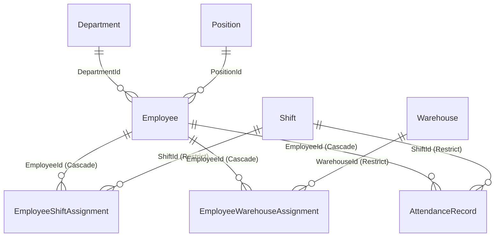

# Personnel Management Module

Domain entities, API endpoints, frontend routes, and workflows for the HR/personnel module.

## Overview

The Personnel module covers:
- **Employees** — worker records with contact info, position, department, hire/termination dates
- **Departments** — organizational units
- **Positions** — job titles/roles
- **Shifts** — work shift definitions with start/end times
- **Attendance** — daily attendance tracking with clock-in/out
- **Shift Assignments** — employee-to-shift time-range assignments
- **Warehouse Assignments** — employee-to-warehouse primary assignments

All entities are tenant-scoped via `BaseEntity`.

---

## Database Schema

Migration: `InitialPersonnel`

### `employees`

| Column | Type | Notes |
|---|---|---|
| `Code` | `varchar(32)` | Unique per tenant |
| `FirstName` | `varchar(128)` | First name |
| `LastName` | `varchar(128)` | Last name |
| `MiddleName` | `varchar(128)` | Optional patronymic |
| `Email` | `varchar(256)` | Optional |
| `Phone` | `varchar(64)` | Optional |
| `HireDate` | `DateTime?` | Hire date |
| `TerminationDate` | `DateTime?` | Termination date (null = active) |
| `PositionId` | `Guid?` | FK → `positions` (Restrict) |
| `DepartmentId` | `Guid?` | FK → `departments` (Restrict) |
| `ApplicationUserId` | `Guid?` | Link to ASP.NET Identity user |
| `IsActive` | `bool` | Soft disable flag |

Unique index: `(TenantId, Code)`.

### `departments`

| Column | Type | Notes |
|---|---|---|
| `Code` | `varchar(32)` | Unique per tenant |
| `Name` | `varchar(256)` | Display name |
| `Description` | `varchar(512)` | Optional |
| `IsActive` | `bool` | Soft disable flag |

### `positions`

| Column | Type | Notes |
|---|---|---|
| `Code` | `varchar(32)` | Unique per tenant |
| `Name` | `varchar(256)` | Display name |
| `Description` | `varchar(512)` | Optional |
| `IsActive` | `bool` | Soft disable flag |

### `shifts`

| Column | Type | Notes |
|---|---|---|
| `Code` | `varchar(32)` | Unique per tenant |
| `Name` | `varchar(128)` | Display name |
| `StartTime` | `TimeOnly` | Shift start |
| `EndTime` | `TimeOnly` | Shift end |
| `IsActive` | `bool` | Soft disable flag |

### `attendance_records`

| Column | Type | Notes |
|---|---|---|
| `EmployeeId` | `Guid` | FK → `employees` (Cascade) |
| `ShiftId` | `Guid` | FK → `shifts` (Restrict) |
| `Date` | `DateTime` | Attendance date |
| `ClockInUtc` | `DateTime?` | Clock-in time |
| `ClockOutUtc` | `DateTime?` | Clock-out time |
| `Status` | `varchar(32)` | Enum stored as string |
| `Notes` | `varchar(1024)` | Optional |

### `employee_shift_assignments`

| Column | Type | Notes |
|---|---|---|
| `EmployeeId` | `Guid` | FK → `employees` (Cascade) |
| `ShiftId` | `Guid` | FK → `shifts` (Restrict) |
| `EffectiveFromUtc` | `DateTime` | Assignment start |
| `EffectiveToUtc` | `DateTime?` | Assignment end (null = indefinite) |

Unique index: `(TenantId, EmployeeId, EffectiveFromUtc)`.

### `employee_warehouse_assignments`

| Column | Type | Notes |
|---|---|---|
| `EmployeeId` | `Guid` | FK → `employees` (Cascade) |
| `WarehouseId` | `Guid` | FK → `warehouses` (Restrict) |
| `IsPrimary` | `bool` | Primary warehouse flag |

Unique index: `(TenantId, EmployeeId, WarehouseId)`.

---

## Enums

### `AttendanceStatus`
| Value | Russian |
|---|---|
| `Present` | Присутствует |
| `Absent` | Отсутствует |
| `Late` | Опоздание |
| `EarlyDeparture` | Ранний уход |
| `Overtime` | Сверхурочно |

---

## Entity Relationships



---

## API Endpoints

Base: `/api/v1`

### Employees

| Method | Route | Auth |
|---|---|---|
| `GET` | `/employees` | `employees:read` |
| `GET` | `/employees/{id}` | `employees:read` |
| `GET` | `/employees/{id}/detail` | `employees:read` |
| `POST` | `/employees` | `employees:write` |
| `PUT` | `/employees/{id}` | `employees:write` |
| `DELETE` | `/employees/{id}` | `employees:delete` |

The `/detail` endpoint includes `shiftAssignments` and `warehouseAssignments` nested collections.

### Departments

| Method | Route | Auth |
|---|---|---|
| `GET` | `/departments` | `departments:read` |
| `GET` | `/departments/{id}` | `departments:read` |
| `POST` | `/departments` | `departments:write` |
| `PUT` | `/departments/{id}` | `departments:write` |
| `DELETE` | `/departments/{id}` | `departments:delete` |

### Positions

| Method | Route | Auth |
|---|---|---|
| `GET` | `/positions` | `positions:read` |
| `GET` | `/positions/{id}` | `positions:read` |
| `POST` | `/positions` | `positions:write` |
| `PUT` | `/positions/{id}` | `positions:write` |
| `DELETE` | `/positions/{id}` | `positions:delete` |

### Shifts

| Method | Route | Auth |
|---|---|---|
| `GET` | `/shifts` | `shifts:read` |
| `GET` | `/shifts/{id}` | `shifts:read` |
| `POST` | `/shifts` | `shifts:write` |
| `PUT` | `/shifts/{id}` | `shifts:write` |
| `DELETE` | `/shifts/{id}` | `shifts:delete` |

### Attendance

| Method | Route | Auth |
|---|---|---|
| `GET` | `/attendance?from=&to=` | `attendance:read` |
| `GET` | `/attendance/{id}` | `attendance:read` |
| `POST` | `/attendance` | `attendance:write` |
| `PUT` | `/attendance/{id}` | `attendance:write` |
| `DELETE` | `/attendance/{id}` | `attendance:delete` |

---

## Frontend

### Models — `personnel.model.ts`

```typescript
interface Position { id, code, name, description?, isActive }
interface Department { id, code, name, description?, isActive }
interface Employee { id, code, firstName, lastName, middleName?, email?, phone?, hireDate?, terminationDate?, positionId?, positionName?, departmentId?, departmentName?, applicationUserId?, linkedUserName?, isActive }
interface EmployeeDetailModel extends Employee { shiftAssignments, warehouseAssignments }
interface Shift { id, code, name, startTime, endTime, isActive }
interface AttendanceRecord { id, employeeId, employeeName?, shiftId, shiftName?, date, clockInUtc?, clockOutUtc?, status, notes? }
```

### Routes

Lazy-loaded under `/personnel`:

| Route | Component |
|---|---|
| `/personnel/employees` | `EmployeeList` |
| `/personnel/employees/new` | `EmployeeForm` |
| `/personnel/employees/:id` | `EmployeeDetail` |
| `/personnel/employees/:id/edit` | `EmployeeForm` |
| `/personnel/positions` | `PositionList` |
| `/personnel/positions/new` | `PositionForm` |
| `/personnel/positions/:id/edit` | `PositionForm` |
| `/personnel/departments` | `DepartmentList` |
| `/personnel/departments/new` | `DepartmentForm` |
| `/personnel/departments/:id/edit` | `DepartmentForm` |
| `/personnel/shifts` | `ShiftList` |
| `/personnel/shifts/new` | `ShiftForm` |
| `/personnel/shifts/:id/edit` | `ShiftForm` |
| `/personnel/attendance` | `AttendanceList` |
| `/personnel/attendance/new` | `AttendanceForm` |
| `/personnel/attendance/:id/edit` | `AttendanceForm` |

### Service — `PersonnelService`

Full CRUD for all 5 sub-features (25 methods). Each returns `Observable<T>`. Uses `HttpClient` with `${AppSettings.apiBaseUrl}` prefix.

### Sidebar Navigation

Under "Персонал" group:
- Сотрудники → `/personnel/employees`
- Должности → `/personnel/positions`
- Отделы → `/personnel/departments`
- Смены → `/personnel/shifts`
- Посещаемость → `/personnel/attendance`

### Component Patterns

- **Standalone components** with lazy loading
- **Signal-based state**: `signal()` and `computed()`
- **DevExtreme grids**: `dx-data-grid` with inline edit/delete action columns
- **DevExtreme forms**: `dx-form` with `formItems()` signal pattern
- **Employee form**: includes dropdowns for Position, Department (loaded from respective services)
- **Employee detail**: shows shift assignments and warehouse assignments in nested grids
- **Attendance list**: date range filter via query parameters
- **Attendance form**: employee dropdown + shift dropdown + status dropdown
